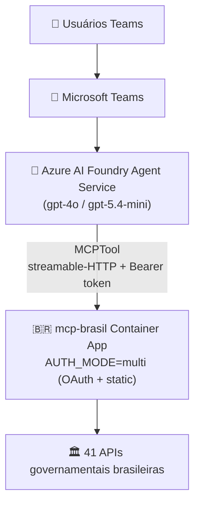

# Deploy — Microsoft Teams via Azure AI Foundry

Guia completo para publicar o mcp-brasil como agente no Microsoft Teams usando
o Azure AI Foundry Agent Service com MCPTool. Cobre desde a criação da
infraestrutura Azure do zero até a publicação no Teams.

## Arquitetura



O Foundry Agent Service conecta ao mcp-brasil via MCPTool usando **auth
key-based** (Bearer token estático). O mcp-brasil roda com `AUTH_MODE=multi`
para aceitar simultaneamente OAuth (Claude.ai) e Bearer token (Foundry).

---

## Parte 1 — Infraestrutura Azure (do zero)

> Se você já tem o mcp-brasil deployado no Azure, pule para a **Parte 2**.

### 1.1 Pré-requisitos

- Azure CLI (`az`) instalado e autenticado: `az login`
- Uma subscription Azure ativa
- Python 3.10+ e `uv` instalados localmente
- Git clone do repositório `mcp-brasil`

### 1.2 Criar Resource Group

```bash
RESOURCE_GROUP=rg-mcp-brasil
LOCATION=eastus2

az group create --name $RESOURCE_GROUP --location $LOCATION
```

### 1.3 Criar Azure Container Registry (ACR)

```bash
ACR_NAME=mcpbrasilacr$(openssl rand -hex 3)

az acr create \
  --name $ACR_NAME \
  --resource-group $RESOURCE_GROUP \
  --sku Basic \
  --admin-enabled true
```

### 1.4 Build e push da imagem

```bash
az acr build \
  -r $ACR_NAME \
  -t mcp-brasil:latest \
  -f Dockerfile .
```

### 1.5 Criar Container App Environment

```bash
az containerapp env create \
  --name mcp-brasil-env \
  --resource-group $RESOURCE_GROUP \
  --location $LOCATION
```

### 1.6 Gerar um token estático

```bash
# Gerar token aleatório para autenticação
MCP_TOKEN=$(python3 -c "import secrets; print(secrets.token_urlsafe(32))")
echo "MCP_BRASIL_API_TOKEN=$MCP_TOKEN"
# Salve este token — será usado no Foundry
```

### 1.7 Criar o Container App

```bash
ACR_SERVER=$(az acr show -n $ACR_NAME --query loginServer -o tsv)
ACR_USER=$(az acr credential show -n $ACR_NAME --query username -o tsv)
ACR_PASS=$(az acr credential show -n $ACR_NAME --query "passwords[0].value" -o tsv)

az containerapp create \
  --name mcp-brasil \
  --resource-group $RESOURCE_GROUP \
  --environment mcp-brasil-env \
  --image $ACR_SERVER/mcp-brasil:latest \
  --target-port 8000 \
  --ingress external \
  --registry-server $ACR_SERVER \
  --registry-username $ACR_USER \
  --registry-password $ACR_PASS \
  --env-vars \
    MCP_BRASIL_AUTH_MODE=multi \
    MCP_BRASIL_API_TOKEN=$MCP_TOKEN \
    MCP_BRASIL_OAUTH_PROVIDER=azure \
    MCP_BRASIL_BASE_URL=https://$(az containerapp show -n mcp-brasil -g $RESOURCE_GROUP --query "properties.configuration.ingress.fqdn" -o tsv) \
    AZURE_CLIENT_ID=<seu-client-id> \
    AZURE_CLIENT_SECRET=<seu-client-secret> \
    AZURE_TENANT_ID=<seu-tenant-id> \
    AZURE_REQUIRED_SCOPES=read
```

> Para `AUTH_MODE=multi`, é necessário configurar **tanto** o token estático
> quanto o OAuth. Se não precisar de OAuth (Claude.ai), use `AUTH_MODE=static`.

### 1.8 Obter URL pública

```bash
MCP_URL=https://$(az containerapp show -n mcp-brasil -g $RESOURCE_GROUP \
  --query "properties.configuration.ingress.fqdn" -o tsv)/mcp
echo "MCP Server URL: $MCP_URL"
```

### 1.9 Verificar o deploy

```bash
# Deve retornar 200 com token válido
curl -sS -i -X POST $MCP_URL \
  -H "Content-Type: application/json" \
  -H "Accept: application/json, text/event-stream" \
  -H "Authorization: Bearer $MCP_TOKEN" \
  -d '{"jsonrpc":"2.0","method":"initialize","id":1,"params":{"protocolVersion":"2025-03-26","capabilities":{},"clientInfo":{"name":"test","version":"1.0"}}}'
```

### 1.10 Criar Azure AI Services + Projeto Foundry

```bash
AI_RESOURCE_NAME=agent-brasil-resource
AI_PROJECT_NAME=agent-brasil

# Criar o recurso AI Services
az cognitiveservices account create \
  --name $AI_RESOURCE_NAME \
  --resource-group $RESOURCE_GROUP \
  --kind AIServices \
  --sku S0 \
  --location $LOCATION

# Deployar modelo
az cognitiveservices account deployment create \
  --name $AI_RESOURCE_NAME \
  --resource-group $RESOURCE_GROUP \
  --deployment-name gpt-4o \
  --model-name gpt-4o \
  --model-version 2024-11-20 \
  --model-format OpenAI \
  --sku-name GlobalStandard \
  --sku-capacity 10
```

> O **Projeto AI Foundry** (`agent-brasil`) precisa ser criado no
> [Portal Foundry](https://ai.azure.com) ligado ao recurso AI Services acima.
> Isso ainda não tem CLI direta.

---

## Parte 2 — Configurar MCP Tool no Foundry

### 2.1 Ativar o novo portal Foundry

No [ai.azure.com](https://ai.azure.com), ative o toggle **"Nova Fábrica"**
no canto superior direito. A interface clássica não mostra a opção MCP.

### 2.2 Adicionar tool MCP ao projeto

1. Foundry Portal → abra o projeto
2. Menu lateral: **Ferramentas** (ou **Add Tools**)
3. Clique **+ Adicionar ferramenta** → **Custom** → **MCP**
4. Preencha o formulário:

| Campo | Valor |
|-------|-------|
| **Nome** | `mcp-brasil` |
| **Ponto de extremidade do Servidor MCP Remoto** | `https://<seu-fqdn>/mcp` |
| **Autenticação** | `Baseado em chave` |
| **Credencial (chave)** | `Authorization` |
| **Credencial (valor)** | `Bearer <MCP_BRASIL_API_TOKEN>` |

5. Clique **Conectar-se**

> **Por que key-based e não OAuth?** O Foundry OAuth Identity Passthrough
> é incompatível com o OAuth DCR (Dynamic Client Registration) do FastMCP.
> O modo `multi` no mcp-brasil aceita Bearer token estático como fallback,
> mantendo OAuth funcional para clientes como Claude.ai.

### 2.3 Criar o agente via script

```bash
# Instalar dependências do Foundry
uv sync --group foundry

# Configurar variáveis
export PROJECT_ENDPOINT="https://<ai-resource>.services.ai.azure.com/api/projects/<project>"
export MODEL_DEPLOYMENT="gpt-4o"
export MCP_BRASIL_URL="https://<seu-fqdn>/mcp"
export MCP_CONNECTION_ID="mcp-brasil"  # nome da tool criada no passo 2.2

# Criar agente
python scripts/foundry_agent.py create
# Output: Agent created: name=agente-brasil, version=1, id=agente-brasil:1
```

### Alternativa: Criar pelo Portal

1. Foundry Portal → **Agentes** → **+ Novo agente**
2. Nome: `Agente Brasil`
3. Modelo: `gpt-4o`
4. Instruções: cole o system prompt abaixo
5. Ações → **+ Adicionar** → selecione a tool `mcp-brasil`
6. Clique **Salvar**

<details>
<summary>System prompt do agente</summary>

```
Você é o Agente Brasil, um assistente especializado em dados governamentais
brasileiros. Você tem acesso a 41 APIs públicas via ferramentas MCP.

Regras:
1. Sempre responda em português brasileiro
2. Cite a fonte dos dados (ex: "Fonte: Banco Central do Brasil via API SGS")
3. Para consultas complexas, use planejar_consulta primeiro
4. Para múltiplas consultas simultâneas, use executar_lote
5. Se não souber qual ferramenta usar, use recomendar_tools
6. Formate números com separadores brasileiros (ex: R$ 1.234.567,89)
7. Inclua a data de referência dos dados quando disponível
8. Seja conciso mas completo — usuários estão no Teams, preferem respostas diretas

APIs disponíveis: IBGE, Banco Central, Câmara dos Deputados, Senado Federal,
Portal da Transparência, DataJud/CNJ, TSE, INPE, ANVISA, CNES/DataSUS, PNCP,
TCU, TCEs estaduais, BrasilAPI, dados.gov.br, e mais.
```

</details>

---

## Parte 3 — Testar

### 3.1 Testar no Playground

No Foundry Portal → Agentes → selecione `agente-brasil` → **Playground**.

Teste com perguntas como:

- "Qual a taxa Selic atual?"
- "Quais são as 10 maiores cidades do Brasil por população?"
- "Quais projetos de lei foram votados esta semana na Câmara?"

### 3.2 Testar via script

```bash
python scripts/foundry_agent.py test --question "Qual a taxa Selic atual?"
```

### 3.3 Verificar logs do Container App

```bash
az containerapp logs show -n mcp-brasil -g $RESOURCE_GROUP --tail 30
```

---

## Parte 4 — Publicar no Teams

### 4.1 Publicar

1. No Playground do agente, clique **Publicar** (canto superior direito)
2. Selecione **Microsoft Teams**
3. Configure:
   - **App name:** `Agente Brasil`
   - **Descrição:** `Consulte dados governamentais brasileiros — IBGE,
     Banco Central, Câmara, Senado, Transparência e mais.`
   - **Ícone:** use `docs/logo.png` do repositório
4. Clique **Publicar**

### 4.2 Aprovação no M365 Admin Center

Após publicar, um admin do M365 precisa aprovar:

1. [M365 Admin Center](https://admin.microsoft.com) → **Settings** →
   **Integrated apps** (ou **Teams apps** → **Manage apps**)
2. Encontre `Agente Brasil` na lista de apps pendentes
3. Clique **Approve** → defina quem pode usar (todos ou grupos específicos)
4. Aguarde propagação (~1-2 horas)

### 4.3 Testar no Teams

1. Abra o Microsoft Teams
2. Pesquise por "Agente Brasil" na barra de busca
3. Inicie uma conversa
4. Envie: "Qual a taxa Selic atual?"
5. Verifique que a resposta contém dados reais do Banco Central

---

## Troubleshooting

### 401 Unauthorized do MCP server

- Verifique que `AUTH_MODE=multi` (ou `static`) está configurado no
  Container App
- Verifique que o token na Connection do Foundry bate com
  `MCP_BRASIL_API_TOKEN` no Container App
- Teste manualmente:
  ```bash
  curl -sS -H "Authorization: Bearer <token>" \
    -H "Accept: application/json, text/event-stream" \
    -H "Content-Type: application/json" \
    -X POST https://<fqdn>/mcp \
    -d '{"jsonrpc":"2.0","method":"initialize","id":1,"params":{"protocolVersion":"2025-03-26","capabilities":{},"clientInfo":{"name":"test","version":"1.0"}}}'
  ```

### "Client Not Registered" no OAuth

Este erro aparece se a Connection do Foundry usa "Passagem de Identidade
OAuth" apontando para os endpoints do FastMCP. **Solução:** troque a
autenticação da Connection para "Baseado em chave" (key-based). O OAuth
DCR do FastMCP é incompatível com o OAuth Identity Passthrough do Foundry.

### Agente não encontra tools do MCP

- Verifique que a Connection/Tool está configurada corretamente
- O mcp-brasil usa `code_mode` por padrão — o agente chama `search_tools`
  antes de usar tools específicas (isso é esperado e automático)
- Verifique que o mcp-brasil responde:
  ```bash
  curl -sS https://<fqdn>/mcp
  ```

### Timeout nas respostas

- MCPTool tem timeout de 100s para chamadas não-streaming
- Se consultas demoram mais, ajuste scaling no Container App:
  ```bash
  az containerapp update -n mcp-brasil -g $RESOURCE_GROUP \
    --min-replicas 1 --max-replicas 5
  ```

### Atualizar a imagem após mudanças no código

```bash
# Rebuild e push
az acr build -r $ACR_NAME -t mcp-brasil:latest -f Dockerfile .

# Atualizar Container App
az containerapp update -n mcp-brasil -g $RESOURCE_GROUP \
  --image $ACR_SERVER/mcp-brasil:latest
```

---

## Custos estimados

| Componente | Custo |
|------------|-------|
| Foundry Agent Service | Gratuito |
| GPT-4o | ~$2.50/1M input, ~$10/1M output |
| GPT-5.4-mini | ~$0.40/1M input, ~$1.60/1M output |
| Container App | Consumption plan (~$0.000016/vCPU-s) |
| ACR Basic | ~$5/mês |
| AI Services (S0) | Pay-per-use (sem custo fixo) |

Para POC, recomenda-se `gpt-5.4-mini` para reduzir custos.

---

## Cleanup

```bash
# Deletar agente do Foundry
python scripts/foundry_agent.py delete

# Deletar Container App (cuidado: remove o server MCP)
az containerapp delete -n mcp-brasil -g $RESOURCE_GROUP --yes

# Deletar todo o resource group (remove TUDO)
az group delete --name $RESOURCE_GROUP --yes --no-wait
```

---

## Referências

- [Connect to MCP Server Endpoints — Microsoft Foundry](https://learn.microsoft.com/en-us/azure/foundry/agents/how-to/tools/model-context-protocol)
- [Set Up MCP Server Authentication — Microsoft Foundry](https://learn.microsoft.com/en-us/azure/foundry/agents/how-to/mcp-authentication)
- [azure-ai-projects SDK (PyPI)](https://pypi.org/project/azure-ai-projects/)
- [Deploy com OAuth — azure-oauth.md](azure-oauth.md)
